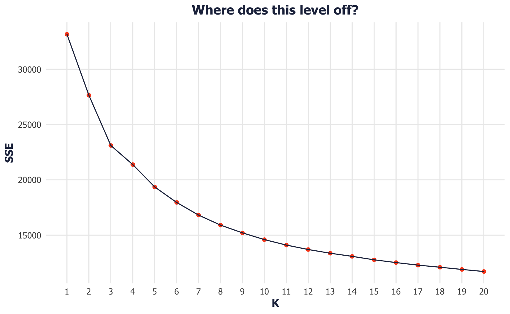
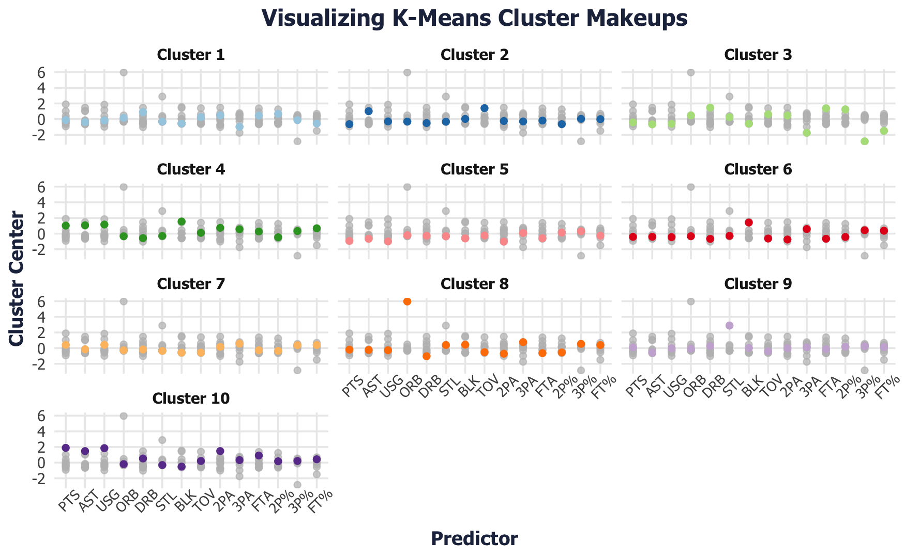

# 🏀 Reimagining NBA Player Roles Using Clustering

> By Yashwant Sathish Kumar
---

## 📌 Overview

Modern basketball is evolving — traditional positions like PG, SG, SF, PF, and C no longer reflect how players actually operate on the court. In this project, I built a K-Means clustering model to reclassify NBA players into **data-driven roles** based on their **offensive and defensive playstyle metrics**.

Rather than relying on outdated positional labels, this approach lets coaches, analysts, and fans understand **how** a player contributes — whether they’re a **3&D wing**, an **offensive generator**, or a **rebounding specialist**.

---

## 🔍 Objective

- Group NBA players into **playstyle-based roles** instead of fixed positions.
- Provide **interpretable, rate-adjusted clusters** that reflect what players actually do on the court.
- Offer a framework that can be useful for **coaching decisions**, **lineup construction**, and **player scouting**.

---

## 📊 Dataset

- **Source**: Scraped from [Basketball-Reference](https://www.basketball-reference.com) using the [`nbastatR`](https://www.rdocumentation.org/packages/nbastatR/versions/0.1.10131) R package.
- **Seasons**: 2015–2016 through 2023–2024.
- **Filter**: Included only players with >1000 minutes in a season.
- **Final Size**: ~4,900 player-seasons across 9 seasons.
- **Features**: 14 rate-adjusted metrics covering shooting, rebounding, playmaking, usage, and defensive impact, including:
  - `pctFG3`, `pctFG2`, `fg3aPerMinute`, `ptsPerMinute`
  - `pctORB`, `pctDRB`, `pctAST`, `pctUSG`
  - `pctSTL`, `pctBLK`, `pctTOV`, etc.

---

## 🧠 Methodology

1. **Data Cleaning & Filtering**
   - Filtered for players with ≥1000 minutes.
   - Standardized all features using z-scores for interpretability.

2. **Clustering Approach**
   - Used **K-Means Clustering** to group players based on standardized playstyle metrics.
   - Determined optimal number of clusters (**k = 10**) using the **Elbow Method**.

3. **Cluster Labeling**
   - Interpreted each cluster using its statistical profile.
   - Named clusters based on their standout traits (e.g. "Elite Perimeter Scorers", "Rebounding Bigs", "3 & D Wings").

---

## 🧾 Role Examples

| Cluster Name             | Description |
|--------------------------|-------------|
| **Interior Slashers**     | High FG% on 2s, high FTrate, frequent rim attacks |
| **Pass-First Playmakers** | High AST%, low scoring volume |
| **Rebounding Big Men**    | High ORB% and DRB%, efficient 2-point scorers |
| **Elite Perimeter Scorers** | High usage, high 3P%, high assist rates |
| **3 & D Players**         | High 3PA and STL/BLK%, low usage |
| **Offensive Generators**  | High usage, PTS/min, AST% |

These clusters represent functional player roles — helping teams scout, compare, and replace players more effectively than using rigid positional categories.

---

## 📈 Visuals

>   
> *Elbow plot used to select optimal number of clusters (k = 10) by identifying point of diminishing returns in total within-cluster error*

>   
> *Standardized cluster centers visualized to interpret and label playstyle-based roles like "Pure Shooters" and "Offensive Generators"*
---

## 🏀 Why This Matters

As someone passionate about basketball strategy and data science, I built this project to bridge the gap between **statistical analysis** and **real-world basketball decision-making**. By clustering players by role:

- **Coaches** can replace injured players with others who match their on-court impact, not just their position.
- **Front offices** can better target role fits in trades or the draft.
- **Fans** can debate and compare players based on what they do, not where they’re listed.

---

## 📂 Tools Used

- **Language**: R  
- **Packages**: `nbastatR`, `dplyr`, `ggplot2`, `cluster`, `factoextra`  
- **Techniques**: K-Means Clustering, Elbow Method, z-score normalization, custom visualizations

---

## 🧠 What I Learned

- How to structure a complete unsupervised learning project from raw scraping to interpretation
- How to translate complex statistical results into **simple narratives for coaches and fans**
- The value of **rate-adjusted metrics** over raw box score totals in player evaluation

---

